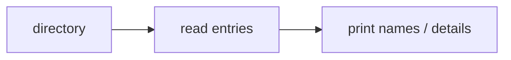

# ls (List Directory)

The ls command lists files and directories so you can inspect your current location or another path.

By default, the ls command will list the directories and files in your current directory. However, you can also specify a path to list the contents of a different directory.

```bash
ls
ls /home/pete
```

> 🧠 **Think of it like…** opening a drawer to see what's inside. Flags decide how much detail you want — a quick glance, or the full inventory.

**Under the hood:**



## Viewing Hidden files

Not all files in a directory are visible by default. In Linux, filenames that start with a dot `(.)` are hidden. You can view them with the `-a` option, which stands for all.

```bash
ls -a
.  ..  .bashrc  Documents  Pictures
```

## Getting Detailed Information

Another essential ls option is -l for long format. It shows file permissions, number of links, owner, group, size, modification time, and name.

```bash
ls -l
```

add `-h` for human-readable output:

```bash
ls -lh
```

## Sorting in Reverse Order

Sometimes you may want to change the sort order. The `-r` option lists files and directories in reverse order.

```bash
ls -r
```

You can sort by modification time with -t, then reverse it with -r:

```bash
ls -lt
ls -ltr
```

## Combining Command Flags

Commands have flags, also called options, to add more functionality. As we saw with `-a` and `-l`, you can combine them into a single command like `ls -la`. The order of the flags often does not matter, so `ls -al` works the same way.

```bash
ls -lh
ls -la
ls -ltr
```

## Common ls Options

| Option | Description |
| --- | --- |
| `-a` | Show all files, including hidden files. |
| `-l` | Use long format. |
| `-h` | Show human-readable sizes (with `-l`). |
| `-r` | Reverse the sort order. |
| `-t` | Sort by modification time. |
| `-S` | Sort by file size. |
| `-d` | List the directory itself instead of its contents. |
