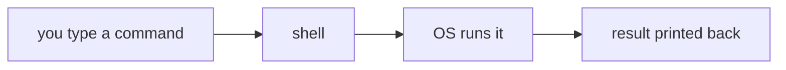

# The Shell

> 🧠 **Think of it like…** texting the computer precise instructions instead of pointing and clicking your way around.

**Under the hood:**



## What is the Linux shell
1. A shell is a program that lets us type command and accepts them, then ask the OS to run them and prints the result back to us. 
2. In the GUI, we click windows, menu, button but in shell it is set at typing precise instructions. 

## Interacting with the Bash shell 

Bash is one of the most common Linux shells used. It set foundation for other shell such as zsh, fish.\
When we open our shell we are prompted with greetings and it shows us : username, host name and current directory

```Plaintext
pete@icebox:/home/pete $
```

*$* indicates that shell is ready to accept our input as a normal user.\
*#* indicates sudo user.

#### Commands often follow this pattern:

```bash
command options arguments
```

### Common Beginner Tips
- Press Enter to run a command.
- Use the Up Arrow key to recall a previous command.
- Commands and filenames are case-sensitive in Linux.
- Spaces matter. echo hello and echohello are different.
- If a command seems stuck, Ctrl-C often cancels it.

##### Question

1. Is the shell the same as the terminal?
Not excatly, The terminal is the window or application that we type into and shell is the program running inside it.
