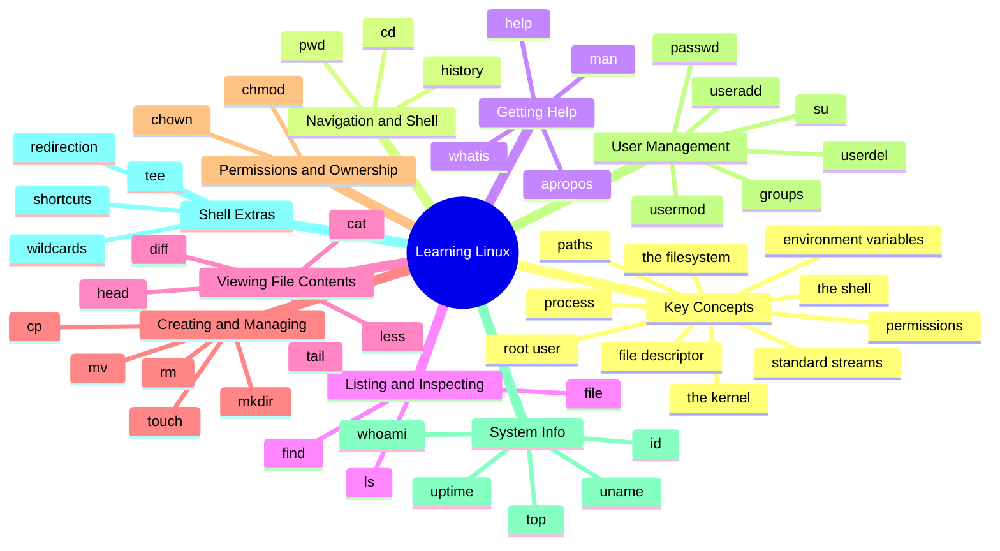

# 🗺️ Linux Mind Map

Every command and core concept in this repo, in one tree — grouped the same way as the [cheatsheet](CHEATSHEET.md). **10 concepts · 37 commands** across 10 groups.

> The diagram below is a [Mermaid](https://mermaid.js.org/) mind map, which GitHub renders automatically. A plain-text [outline](#outline) follows for quick scanning.

## Outline

A text version of the same map — handy as a quick index.

- **🧠 Key Concepts** — the shell · the kernel · standard streams · file descriptor · the filesystem · paths · permissions · root · process · environment variables
- **Navigation & Shell** — `pwd` · `cd` · `history`
- **Getting Help** — `man` · `whatis` · `apropos` · `help`
- **Listing & Inspecting** — `ls` · `file` · `find`
- **Viewing File Contents** — `cat` · `less` · `head` · `tail` · `diff`
- **Creating & Managing** — `touch` · `mkdir` · `cp` · `mv` · `rm`
- **Permissions & Ownership** — `chmod` · `chown`
- **User Management** — `useradd` · `passwd` · `usermod` · `userdel` · `groups` · `su`
- **System Info** — `whoami` · `id` · `uname` · `uptime` · `top`
- **Shell Extras** — redirection (`>` `>>` `<` `|` `2>`) · `tee` · wildcards (`*` `?`) · shortcuts (`Tab`, `Ctrl-C`)

---

*See the [README](README.md) for links to the full note on each command, or the [cheatsheet](CHEATSHEET.md) for options and examples.*
