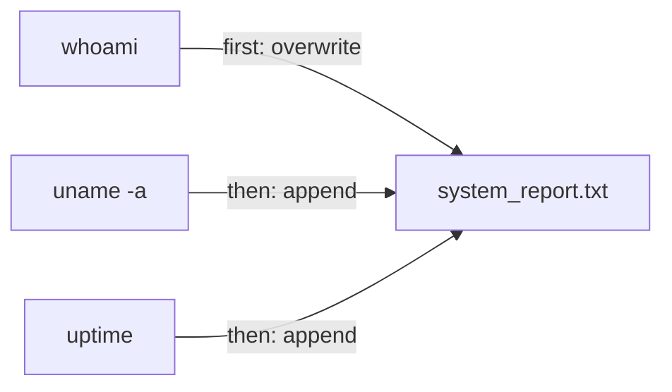

# The Lay of the Land (System Reconnaissance)

A hands-on walkthrough of the commands you reach for first on an unfamiliar machine: confirming who you are, what the system is, how long it has been running, and saving it all to a report. It uses `whoami`, `uname`, `uptime`, `id`, `top`, and output redirection.

## First Login and Environment Check

Your first move on a new system is to confirm your identity and which operating system you are on.

Find out the current user with `whoami`, and the kernel name with `uname`:

```bash
whoami
uname
```

```plaintext
labex
Linux
```

These results confirm you are the `labex` user on a Linux system — the starting point for everything else.

## Checking System Information and Uptime

Next, get the full picture of the system and how long it has been up.

`uname -a` prints all system information in one line; `uptime` shows how long the machine has been running and its load average:

```bash
uname -a
uptime
```

```plaintext
Linux labex-virtual-machine 5.15.0-76-generic #83-Ubuntu SMP Thu Jun 15 19:16:32 UTC 2023 x86_64 x86_64 x86_64 GNU/Linux
 14:51:52 up 183 days,  2:55,  0 users,  load average: 6.02, 1.80, 0.94
```

The first line packs in the kernel version, hostname, and hardware architecture. The second shows the uptime (here, 183 days) followed by three load averages — the average system load over the last **1, 5, and 15 minutes**.

## Gathering User and Group Details

Your permissions come from your user ID (UID), primary group ID (GID), and the other groups you belong to. The `id` command shows all three at once:

```bash
id
```

```plaintext
uid=5000(labex) gid=5000(labex) groups=5000(labex),27(sudo),121(ssl-cert),5002(public)
```

- `uid=5000(labex)` — your user ID and username.
- `gid=5000(labex)` — your primary group.
- `groups=...` — every group you belong to, including `sudo` (administrative rights), `ssl-cert`, and `public`.

Run with no arguments, `id` reports on the current user.

## Monitoring Real-Time System Performance

`top` is the standard tool for watching CPU, memory, and running processes live. Launch it, observe for a moment, then press `q` to quit:

```bash
top
```

```plaintext
top - 10:45:00 up 1:15,  1 user,  load average: 0.00, 0.01, 0.05
Tasks: 123 total,   1 running, 122 sleeping,   0 stopped,   0 zombie
%Cpu(s):  0.1 us,  0.1 sy,  0.0 ni, 99.8 id,  0.0 wa,  0.0 hi,  0.0 si,  0.0 st
MiB Mem :   1987.2 total,    890.5 free,    540.1 used,    556.6 buff/cache
MiB Swap:   2048.0 total,   2048.0 free,      0.0 used.   1234.5 avail Mem

    PID USER      PR  NI    VIRT    RES    SHR S  %CPU  %MEM     TIME+ COMMAND
      1 root      20   0  169404  12920   8584 S   0.0   0.6   0:01.50 systemd
      2 root      20   0       0      0      0 S   0.0   0.0   0:00.00 kthreadd
```

The header block summarises the system (uptime, tasks, CPU, memory); the table below lists processes sorted by CPU use. The display refreshes every few seconds. Press `q` to return to the prompt.

## Generating a System Status Report

Finally, save your findings to a text file — a common way to log a system's state at a point in time. Use output redirection to send several commands into one file.

Each command's output is redirected into the same report — the first with `>` (create/overwrite), the rest with `>>` (append):



Create `system_report.txt` with `>` for the first command, then append the rest with `>>`:

```bash
whoami > system_report.txt
uname -a >> system_report.txt
uptime >> system_report.txt
```

Check the result with `cat`:

```bash
cat system_report.txt
```

```plaintext
labex
Linux labex-virtual-machine 5.15.0-76-generic #83-Ubuntu SMP Thu Jun 15 19:16:32 UTC 2023 x86_64 x86_64 x86_64 GNU/Linux
 10:50:01 up  1:20,  1 user,  load average: 0.00, 0.01, 0.05
```

The `>` operator **creates or overwrites** the file with the first command's output; each `>>` **appends** the next command's output without erasing what is already there. The finished file is a snapshot of the system — handy for documentation and troubleshooting. You can verify it any time with `cat`.
