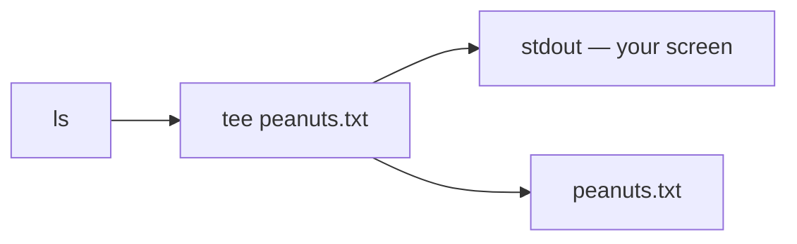

# pipe & tee (Connecting Commands)

The command line becomes far more powerful when you connect commands together. Instead of running one command, saving its output, and running another, you build a **pipeline** that passes data directly from one command to the next.

> 🧠 **Think of it like…** plumbing. The pipe `|` joins one command's output straight into the next command's input — no bucket in between. `tee` is a T-shaped fitting that splits the flow so the same data reaches your screen *and* a file.

**Under the hood — the pipe feeds one command's `stdout` into the next command's `stdin`:**


## The Pipe Operator `|`

Start with a command that produces a lot of output:

```bash
ls -la /etc
```

The list is too long to read on one screen. Rather than redirect it to a file, send it straight into another command — like `less` — for easy viewing:

```bash
ls -la /etc | less
```

The pipe operator `|` (a vertical bar) takes the `stdout` of the command on its **left** and feeds it as the `stdin` of the command on its **right**. Here, the output of `ls -la /etc` flows directly into `less`. You will reach for pipes constantly.

## Splitting Output with `tee`

What if you want to **see** output on screen *and* **save** it to a file at the same time? That is what `tee` does:

```bash
ls | tee peanuts.txt
```

You see the output of `ls` on the terminal, and `peanuts.txt` ends up with the exact same content. `tee` splits the stream two ways: one copy to `stdout`, one to the file.



## Combining Pipe and Tee

Drop `tee` into the *middle* of a pipeline to save an intermediate result while the data keeps flowing:

```bash
ls -la /etc | tee etc_listing.txt | grep "conf"
```

This does three things:

1. Lists the contents of `/etc`.
2. Pipes that output to `tee`, which saves a copy to `etc_listing.txt` **and** passes it along.
3. Pipes `tee`'s output into `grep`, which keeps only lines containing `conf`.

## Quick Reference

| Symbol / Command | What it does |
| --- | --- |
| `a \| b` | Pipe: send `a`'s `stdout` into `b`'s `stdin`. |
| `tee FILE` | Copy `stdin` to both `stdout` and `FILE`. |
| `tee -a FILE` | Append to `FILE` instead of overwriting. |
| `a \| tee FILE \| b` | Save an intermediate result mid-pipeline. |
