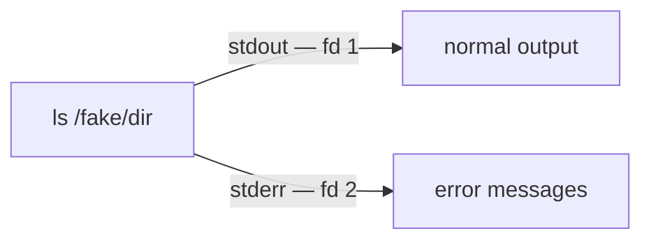

# stderr (Standard Error)

Let's see what happens when a command fails. Try to list a directory that doesn't exist and redirect the output to a file:

```bash
ls /fake/directory > peanuts.txt
```

Instead of a clean prompt, the error still appears on screen:

```plaintext
ls: cannot access /fake/directory: No such file or directory
```

Why wasn't that message sent to the file? Because a *third* I/O stream is at play: standard error, or `stderr`.

> 🧠 **Think of it like…** a machine with two out-chutes: normal results drop out one (`stdout`), and problems drop out a separate one (`stderr`). Both land on your screen by default, so `>` only catches the normal chute.

**Under the hood — a command has two separate output chutes:**



## What Is Standard Error?

`stderr` is a default output stream that programs use for error messages and diagnostics. It is completely separate from `stdout`, which carries normal output. By default **both** go to your terminal, which is why you still see the error even after redirecting `stdout`.

## File Descriptors

To manage its streams, the system gives each one a **file descriptor** — a small number the kernel uses to identify an open stream:

| Descriptor | Stream |
| --- | --- |
| `0` | `stdin` (standard input) |
| `1` | `stdout` (standard output) |
| `2` | `stderr` (standard error) |

The number `2` is the handle for `stderr`, and we use it to control where errors go.

## Redirecting stderr with `2>`

Put the file descriptor `2` in front of `>` to redirect only error messages:

```bash
ls /fake/directory 2> peanuts.txt
```

The terminal stays quiet and the error message lands inside `peanuts.txt`.

## Capturing Both stdout and stderr

To capture normal output *and* errors in the same file, redirect both:

```bash
ls /fake/directory /etc/passwd > peanuts.txt 2>&1
```

- `> peanuts.txt` sends `stdout` (fd 1) to the file.
- `2>&1` sends `stderr` (fd 2) to **wherever fd 1 currently points** — the file.

Order matters: `2>&1` copies the *current* destination of `stdout`, so it must come after `> peanuts.txt`.

A shorter, modern form does both at once:

```bash
ls /fake/directory /etc/passwd &> peanuts.txt
```

## Discarding Errors with /dev/null

To run a command and ignore errors entirely, send `stderr` to `/dev/null` — a special file that discards anything written to it:

```bash
ls /fake/directory 2> /dev/null
```

The command runs and any error output is thrown away, leaving your screen clean.

## Quick Reference

| Redirection | What it does |
| --- | --- |
| `2> file` | Send `stderr` to a file. |
| `2>&1` | Send `stderr` to wherever `stdout` currently goes. |
| `&> file` | Send both `stdout` and `stderr` to a file. |
| `2> /dev/null` | Discard error messages entirely. |
