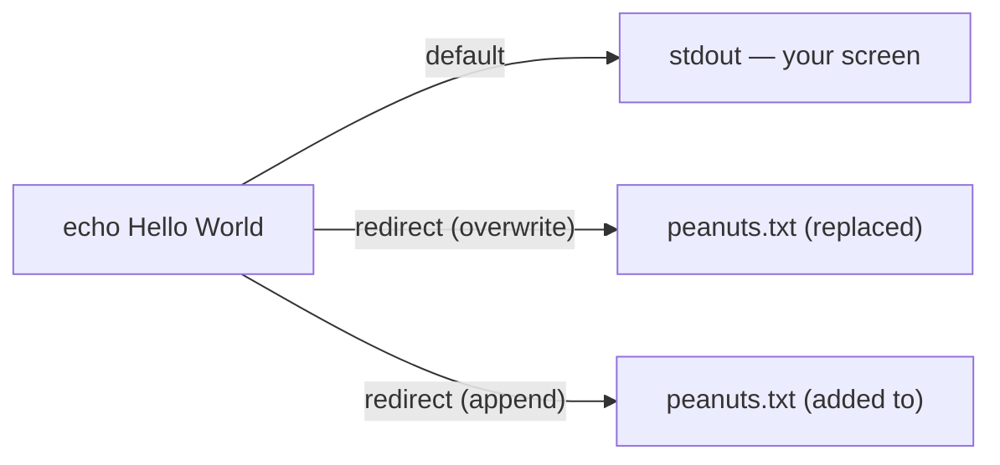

# stdout (Standard Output)

As you use the command line, every command produces output. This brings us to **I/O streams** — how a process receives input and sends output — and specifically to **standard output**, or `stdout`.

Run this command and a new file appears:

```bash
echo Hello World > peanuts.txt
```

Afterwards you will find a file named `peanuts.txt` in the current directory containing the text `Hello World`. Let's break down what happened.

> 🧠 **Think of it like…** rerouting a hose. The output normally sprays onto the screen; `>` points it into a bucket (a file), and `>>` tops that bucket up without emptying it first.

**Under the hood:**



## Understanding Standard Output

First, consider the command on its own, without the special character:

```bash
echo Hello World
```

By default, many commands send their results to `stdout`, which is normally your terminal screen — which is why `echo Hello World` prints straight to the shell. **I/O redirection** lets us change this default behaviour and send that output somewhere else, giving us far more control over our data. (The matching input stream is called **standard input**, or `stdin`.)

## Redirecting stdout with `>`

The `>` character is a **redirection operator**. It intercepts the data heading for `stdout` and sends it to a new destination — here, a file instead of the screen:

```bash
echo Hello World > peanuts.txt
```

If the file does not exist, it is created.

> **`>` overwrites.** If the file already exists, `>` replaces its entire contents. Use it with care.

## Appending stdout with `>>`

To add to a file *without* erasing what is already there, use `>>`:

```bash
echo Hello World >> peanuts.txt
```

This appends the output to the end of the file. Like `>`, it creates the file first if it doesn't already exist. Mastering `stdout` redirection is a fundamental step in your Linux journey.

## Quick Reference

| Operator | What it does |
| --- | --- |
| `>` | Redirect `stdout` to a file, **overwriting** it. |
| `>>` | Redirect `stdout` to a file, **appending** to it. |
